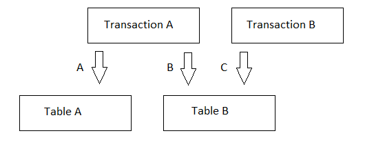

# isolationlevels

В PostgreSQL уровни изоляции устанавливаются на уровне транзакции. Нельзя установить уровень изоляции на уровне таблицы или представления.

## Теория 

### Isolation levels

#### READ COMMITTED

Транзакция может видеть только строки, зафиксированные до её начала. 
Этот уровень изоляции является по умолчанию.

Основные отличительные особенности уровня изоляции READ COMMITTED в PostgreSQL заключаются в том, что каждая новая команда SELECT видит только изменения, сделанные в рамках текущей транзакции, и изменения, сделанные другими транзакциями, только после их фиксации. 
Это означает, что данные могут быть изменены другими транзакциями между командами SELECT в рамках одной транзакции.

#### REPEATABLE READ

Уровень изоляции REPEATABLE READ гарантирует, что данные, прочитанные в рамках транзакции, не будут изменены другими транзакциями до её завершения. 

Это достагается с помощью механизма блокировки доступа к этим данным для других транзакций. 
Для этого используется механизм блокировки строк, который позволяет избежать "грязного чтения" и "неповторяемого чтения".

#### SERIALIZABLE

Уровень изоляции SERIALIZABLE гарантирует, что транзакции будут выполнены так, как если бы они были выполнены последовательно, без пересечения. Это означает, что если две транзакции пытаются изменить одни и те же данные одновременно, одна из них будет отменена с ошибкой сериализации.

В оффициальной документации PostgreSQL при определении уровня изоляции SERIALIZABLE сказано следующее: "Если шаблон чтения и записи среди одновременных сериализуемых транзакций создаст ситуацию, которая не могла бы возникнуть при последовательном (поочередном) выполнении этих транзакций, одна из них будет отменена с ошибкой сериализации". 

Примером ситуации, которая не могла бы возникнуть при последовательном выполнении транзакций, является "фантомное чтение". Например, если транзакция A выполняет SELECT с условием WHERE на некоторую таблицу, а затем транзакция B вставляет новую строку в эту таблицу, которая удовлетворяет условию WHERE, то если обе транзакции выполняются параллельно с уровнем изоляции SERIALIZABLE, то транзакция A будет отменена с ошибкой сериализации.

### Проблема "фантомное чтение"

Если "фантомное чтение" произойдёт, когда две транзакции имеют уровень изоляции REPEATABLE READ или READ COMMITTED, то одна из них будет заблокирована до завершения другой транзакции, чтобы избежать конфликтов при изменении данных.

Если "фантомное чтение" произойдёт, когда одна транзакция имеет уровень изоляции SERIALIZABLE, а вторая - REPEATABLE READ или READ COMMITTED, то транзакция с более высоким уровнем изоляции будет отменена с ошибкой сериализации.

Если "фантомное чтение" произойдёт, когда одна транзакция имеет уровень изоляции REPEATABLE READ, а вторая - READ COMMITTED, то транзакция с уровнем изоляции REPEATABLE READ будет заблокирована до завершения другой транзакции.

### Резервное копирование 

#### SNAPSHOT

SNAPSHOT в PostgreSQL - это точка во времени, на которую можно ссылаться для чтения данных, как если бы они были прочитаны в этот момент времени. Это позволяет избежать блокировок и конфликтов при чтении данных в рамках транзакции.

SNAPSHOT может быть использован для осуществления уровней изоляции. 
Например, установка уровня изоляции REPEATABLE READ с использованием SNAPSHOT позволяет гарантировать, что данные, прочитанные в рамках транзакции, не будут изменены другими транзакциями до её завершения.

SNAPSHOT в PostgreSQL позволяет ссылаться на состояние базы данных на определенный момент времени за счёт механизма многоверсионности (MVCC). 
Каждая транзакция работает с версией данных, которая была актуальна на момент её начала, и не видит изменений, сделанных другими транзакциями после этого момента.

#### SQL Dump

SQL Dump в PostgreSQL - это файл, содержащий SQL-команды для создания и заполнения базы данных. Он используется для резервного копирования и восстановления базы данных. 

Отличие от SNAPSHOT заключается в том, что SQL Dump сохраняет состояние базы данных на момент создания дампа, а SNAPSHOT позволяет ссылаться на состояние базы данных на определенный момент времени.

## Практические задачи 

### Две транзакции и общая таблица

**Дано**: 
- Есть две транзакции и две таблицы в БД. 
- *Транзакция А* взаимодействует с таблицами А и B (стрелочки A и B), *транзакция B* - только с таблицей B (стрелочка C). 

**Последовательность взаимодействия**: 
- *транзакция А* читает данные из таблицы B по ИД от 24 по 78 (стрелочка B), 
- *транзакция B* изменяет данные таблицы B по ИД с 12 до 20 и коммитит изменения (стрелочка C), 
- *транзакция А* читает данные из таблицы B по ИД от 3 до 15 (стрелочка B). 

**Возможные изменения в последовательности взаимодействия**: 
- *транзакция B* изменяет данные таблицы B по ИД с 12 до 34 и коммитит изменения (стрелочка C).
- Опционально: *транзакция B* не выполнила коммит изменений (например, *транзакция А* раньше прочитала данные, или разработчик забыл поставить комманду `COMMIT`). 

**Вопросы**:

Нужно ответить, как будут вести себя транзакции (увидит ли *транзакция А* новые данные, сможет ли *транзакция B* изменить данные, заблокируется ли *таблица B* и т.д.) при следующих условиях: 
1. Обе транзакции имеют уровень изоляции `READ COMMITTED`. 
2. Обе транзакции имеют уровень изоляции `REPEATABLE READ`.
3. Обе транзакции имеют уровень изоляции `SERIALIZABLE`.
4. Транзакция А имеет уровень изоляции `REPEATABLE READ`, а транзакция B - `READ COMMITTED`. Что изменится, если транзакции поменяются уровнями изоляции (транзакция А - `READ COMMITTED`, а транзакция B - `REPEATABLE READ`)? 
5. Транзакция А имеет уровень изоляции `SERIALIZABLE`, а транзакция B - `READ COMMITTED`. Что изменится, если транзакции поменяются уровнями изоляции (транзакция А - `READ COMMITTED`, а транзакция B - `SERIALIZABLE`)? 
6. Транзакция А имеет уровень изоляции `REPEATABLE READ`, а транзакция B - `SERIALIZABLE`. Что изменится, если транзакции поменяются уровнями изоляции (транзакция А - `SERIALIZABLE`, а транзакция B - `REPEATABLE READ`)? 

### Обработка ошибки в рамках транзакции

Когда одна транзакция в PostgreSQL (или запрос в окне в pgAdmin) падает с ошибкой, и мы пытаемся в том же окне выполнить другую транзакцию, то получаем ошибку "current transaction is aborted, commands ignored until end of transaction block". 

Вопросы: 
- Объяснить, как PostgreSQL запоминает, что упала какая-то транзакция/запрос, и на основании этого блокирует выполнение других транзакций/запросов до тех пор, пока не будет выполнена команда rollback. 
- Когда мы получаем данную ошибку в одном окне pgAdmin и переходим в другое окно, чтобы выполнить другую транзакцию/запрос, то получится ли у нас выполнить транзакцию/запрос? Объяснить свой ответ.

Ответы:
- Когда транзакция падает с ошибкой, PostgreSQL помечает ее как "отмененную" (aborted) и блокирует выполнение других транзакций до конца текущей транзакции (до команды COMMIT или ROLLBACK). Это происходит из-за того, что PostgreSQL использует [механизм многоверсионной одновременности (MVCC)](https://en.wikipedia.org/wiki/Multiversion_concurrency_control), который требует, чтобы каждая транзакция работала с "чистым" состоянием базы данных. Если одна транзакция падает, то другие транзакции не могут использовать изменения, внесенные этой транзакцией, пока она не будет завершена.
- Когда вы переходите в другое окно в pgAdmin, вы открываете новое соединение с базой данных и новую транзакцию. Это позволяет вам выполнить другую транзакцию/запрос, не затрагивая заблокированную транзакцию в предыдущем окне. Каждое окно в pgAdmin использует одно соединение с базой данных и одну транзакцию для выполнения всех запросов в этом окне. Соответственно, запрос, выполняемый в первом окне pgAdmin и приводящий к ошибке, выполняется в той же транзакции, что и все последующие запросы.

### Как транзакции видят изменения, сделанные другими транзакциями 

Допустим, мы в первом окне pgAdmin выполнили команду rollback, потом в том же окне - команду update для обновления какой-то строчке в некоторой таблице (команду commit не выполняем). 
После этого мы в том же окне посмотрели обновлённое значение в таблице (это значение действительно будет обновлено, как и ожидалось). Но если мы посмотрим то же самое значение в другом окне pgAdmin, то увидим, что это значение так же будет обновлено, хотя мы не выполняли команду commit в первом окне pgAdmin. 

Вопросы: 
- Объяснить, с чем это связано? 
- Может ли это быть связано с уровнем изоляции, который выставлен по умолчанию в PostgreSQL?  

Ответ: 
- Это связано с уровнем изоляции транзакций в PostgreSQL. По умолчанию, PostgreSQL использует уровень изоляции READ COMMITTED, который позволяет видеть изменения, внесенные другими транзакциями после их фиксации (COMMIT). Если вы выполните команду UPDATE в первом окне pgAdmin, но не выполните COMMIT или ROLLBACK, то изменения будут видны в других транзакциях с уровнем изоляции READ COMMITTED. Если вы хотите избежать этого поведения, вы можете использовать более высокий уровень изоляции (например, SERIALIZABLE), который гарантирует, что все транзакции будут видеть только "чистое" состояние базы данных до своего начала.
